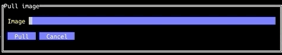
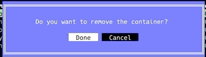

# Docker Desktop TUI
A text UI that mimics docker desktop.\
Members(github usernames): hcyang99, juliajyh
## GUI Specs
Idea originates from https://github.com/skanehira/docui with an implementation by Go.

Functions are as follows:
 - image

    - search/pull/remove
    - save/import/load
 
 - container
    - create/remove
    - start/stop/kill
    - export/commit
 
 The work flow is explained by the following images:
 
 **Pull a new image**:
 

 **Create and configure a new container within the image**
 
 
 **run commands inside container**
 
 
 
 **All actions so far displayed on the Tasks Column**
 
 
 **Result of the bash commands reflected in the status of the new row in container list column**
 
 
 **Remove Container**
 

## Architecture
### Front End
UI code that displays the tui in the tty. Using the Brick library.

### Back End
Executes the docker shell commands using the System.Process library.\
Parses the output from docker shell using the Text.Parsec library.

## Milestone::Challenges
- Could not build Brick demos following the instructions --> Learned to use stack
- Haskell language server continued to crash --> Manually installed the previous version

## Milestone::Progress
- The back-end parser working
- Working on front-end and executing docker shell cmd in Haskell
- Expected to finish on time